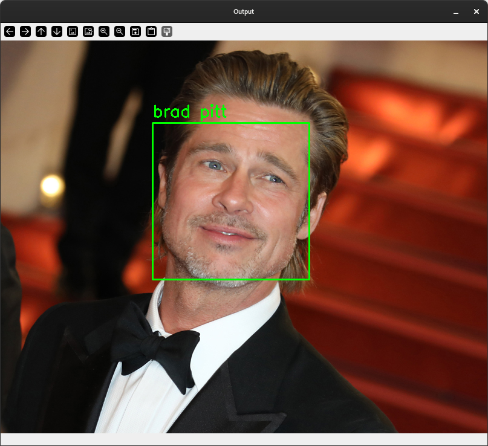

# Face-Detection-using-SVM
Code for a face recognition engine based on Support Vector Machines to detect faces via a webcam captured image. 

<h2>Installing</h2>
<pre>Open terminal and type</pre>
<code>git clone https://github.com/AhmedAzzi/Face-Recognition-SVM-.git </code>  

<h4>or simply download using the url below</h4>
<code> https://github.com/AhmedAzzi/Face-Recognition-SVM-/archive/refs/heads/master.zip </code> 

<h2> Install Requirements </h2>
<code>pip install -r requirements.txt</code>

<h2>Output</h2>

## References
- [Face-Detection-using-SVM]([https://github.com/siddarthsaxena27/Face-Detection-using-SVM](https://github.com/orvil1026/Face-Detection-using-SVM.git))

